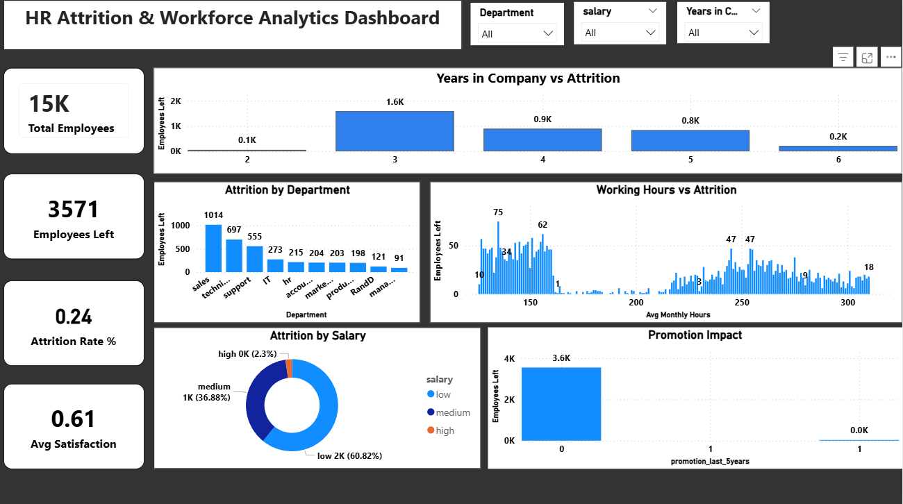
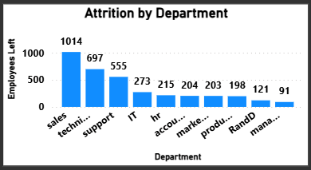
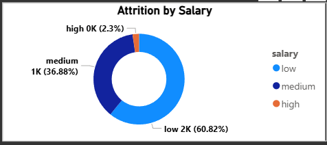
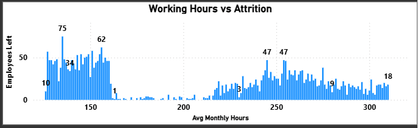
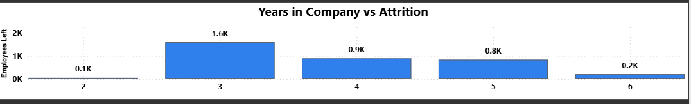

# HR Attrition Analysis Dashboard

## 📌 Project Overview
This project focuses on analyzing employee attrition using HR data to identify the key factors that influence employee turnover. The analysis is designed to help HR teams and management make **data-driven decisions** to improve employee retention and workforce planning.

The dashboard was developed using **Power BI**, with data sourced from Excel, and presents insights through interactive and easy-to-understand visualizations.

---

---
## 📌 Project KPI Overview

This dashboard presents key workforce KPIs to analyze employee attrition and retention trends across the organization. It tracks total employees (15K), employees who left (3,571), overall attrition rate (24%), and average employee satisfaction (0.61) to provide a high-level view of workforce health. The analysis further breaks down attrition by department, salary level, working hours, tenure, and promotion status. Insights reveal higher attrition in Sales and Technical departments, among low-salary employees, and for employees working extreme monthly hours. Attrition is also most prominent among employees with 3–5 years of experience and those who did not receive promotions, highlighting the impact of compensation, workload, and career growth on employee retention. Overall, these KPIs support data-driven HR decision-making and effective workforce planning.

## Business Value

These KPIs collectively help HR teams:

Identify high-risk employee segments

Improve retention strategies

Optimize workload and compensation planning

Support data-driven workforce decisions

## 🛠 Tools & Technologies
- Power BI  
- Microsoft Excel  
- Data Cleaning & Transformation  
- Data Visualization  

---

## 📊 Key Insights
- **Department-wise Attrition:**  
  Sales and Technical departments show the highest employee attrition.

- **Salary-wise Attrition:**  
  Employees in the **low salary** category account for the majority of attrition, indicating compensation as a major factor.

- **Working Hours vs Attrition:**  
  Employees with **very high or very low average monthly working hours** are more likely to leave, highlighting workload imbalance and burnout risks.

- **Years in Company vs Attrition:**  
  Attrition is highest among employees with **3–5 years of experience**, suggesting mid-career dissatisfaction or limited growth opportunities.

---

## 📁 Project Structure

---

## 🖼 Dashboard Preview

### Attrition by Department

### Attrition by Salary

### Working Hours vs Attrition

### Years in Company vs Attrition

---

## 🎯 Conclusion
This project demonstrates how HR analytics combined with interactive dashboards can uncover attrition patterns, identify risk factors, and support strategic decision-making for employee retention.

---

## 👤 Author
**Jyotirmaya Mishra**

